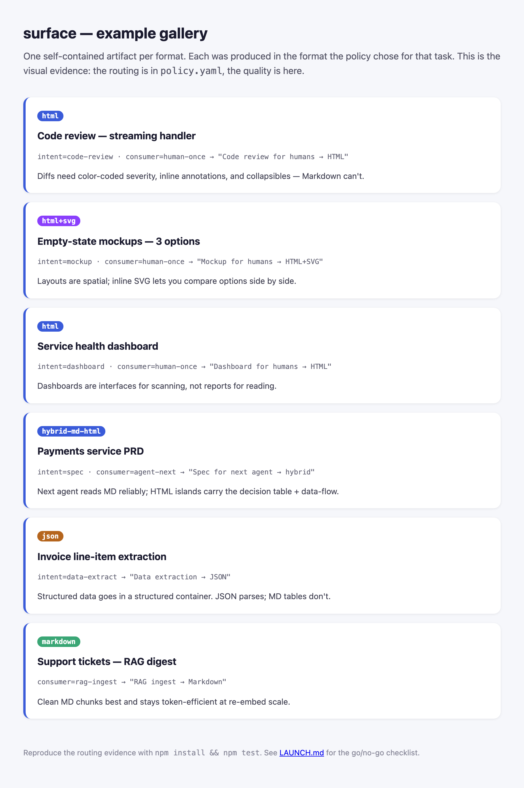
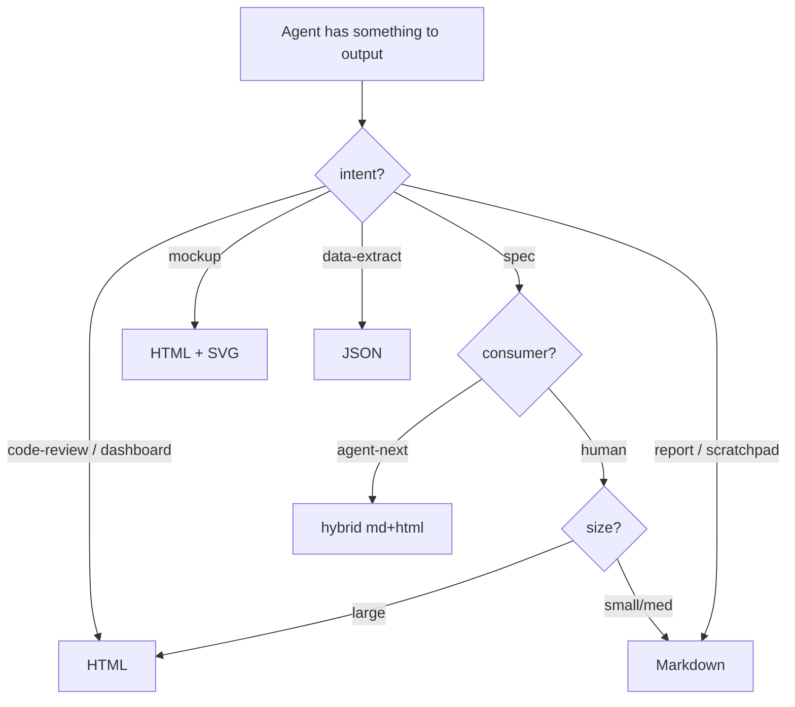

# surface

**Stop guessing what format your AI agent should reply in.**

When an agent finishes a task, it has to pick a format: Markdown? HTML? JSON? Today that choice is a habit — most prompts just say *"respond in markdown"* and move on. `surface` replaces the habit with a rule you can read, edit, and test.

It looks at **five things about the task** and tells the agent which format to use:

| Signal | The question it answers | Example values |
|--------|-------------------------|----------------|
| **intent** | What is this output? | code-review, report, spec, dashboard, data-extract |
| **consumer** | Who reads it next? | a human, the next agent, a RAG index |
| **lifecycle** | Throwaway or kept? | scratchpad vs. saved artifact |
| **size** | How big? | small, medium, large |
| **content** | What's inside? | text, tables, visuals, structured data |

No machine learning. No framework. One YAML file you can open and change. MIT.

---

## See it in one example

Same content — a code review — but the format flips based on *who reads it*:

```text
intent: code-review,  consumer: human       →  HTML   (scannable, collapsible, diff highlighting)
intent: code-review,  consumer: agent-next  →  JSON   (the next agent parses it, doesn't "read" it)
```

That's the whole idea: **the right format is a function of what the output is for.** `surface` makes that function explicit.

---

## Quick start

### 1. Use it as an Agent Skill (recommended — zero code)

Clone it into your agent's skills folder:

```bash
git clone https://github.com/DiegoNogueiraDev/surface-skill ~/.skills/surface
```

Works with Claude Code, Cursor, Codex CLI, Gemini CLI, and other skill-aware agents. The agent reads [`SKILL.md`](./SKILL.md) and applies the policy on its own whenever it produces a real artifact. You write nothing.

### 2. Or call it as TypeScript (optional)

The logic is two small, dependency-free functions in [`scripts/`](./scripts):

```ts
import { decide } from "./scripts/decide";
import { validate } from "./scripts/validate";

// 1. Decide the format from your task's signals
const { format, promptPrefix } = decide(signals, policy);

// 2. After the agent replies, check it actually matches
const check = validate(response, format);
if (!check.ok) console.warn(check.errors);
```

---

## The decision matrix

Read it top to bottom — the **first row that matches wins**. The last row is the fallback.

| Intent | Consumer | Size | Content | → Format |
|--------|----------|------|---------|----------|
| code-review | human | any | any | **html** |
| dashboard | human | any | any | **html** |
| mockup | human | any | any | **html+svg** |
| spec | agent-next | any | any | **hybrid md+html** |
| spec | human | large | any | **html** |
| spec | human | small/med | any | **markdown** |
| report | human | large | tabular/visual | **html** |
| report | human | large | text-heavy | **markdown** |
| report | human | small/med | any | **markdown** |
| data-extract | any | any | any | **json** |
| any | rag-ingest | any | any | **markdown** |
| any | agent-verify | any | visual/interactive | **html** |
| any | agent-verify | any | tabular/structured | **json** |
| scratchpad | any | any | any | **markdown** |
| *(nothing matched)* | | | | **markdown** |

The source of truth is [`policy.yaml`](./policy.yaml). To change a rule, edit that file:

```yaml
rules:
  - name: "Our team always wants HTML for specs"
    match:
      intent: spec
    decide:
      format: html
      reason: "Internal standard, decided 2026-Q2."
```

---

## Run the proof yourself

The matrix isn't just claimed — it's executed in tests:

```bash
npm install && npm test
```

`npm test` does two things, both green today:

- **Routing (12/12)** — runs `decide()` over every case in [`evals.json`](./evals.json) and checks it picked the expected format (and the expected rule).
- **Validation (6/6)** — runs `validate()` over the sample outputs in [`examples/`](./examples) and checks each one really conforms to its format (HTML balanced, JSON parses, SVG scales, Markdown headings monotonic).

Want to see it fail? Flip one `expect.format` in `evals.json` and re-run.

See [`examples/`](./examples) for one real output per format — [`code-review.html`](./examples/code-review.html), [`dashboard.html`](./examples/dashboard.html), [`extraction.json`](./examples/extraction.json), [`mockup.html`](./examples/mockup.html), [`spec.md`](./examples/spec.md), [`rag-summary.md`](./examples/rag-summary.md) — plus a side-by-side gallery in [`index.html`](./examples/index.html).



---

## What surface is *not*

`surface` only decides **which format to use**. It composes with the tools that do the rest:

- **Converting** between formats → [Turndown](https://github.com/mixmark-io/turndown), [markdownify](https://github.com/zcaceres/markdownify-mcp)
- **Enforcing** a schema at decode time → [Instructor](https://github.com/jxnl/instructor), [Outlines](https://github.com/outlines-dev/outlines)
- **Routing** between models → [LLMRouter](https://github.com/ulab-uiuc/LLMRouter)

---

## Why it exists

In May 2026, Anthropic's **Thariq Shihipar** ([@trq212](https://x.com/trq212)) argued *The Unreasonable Effectiveness of HTML* for AI agents, and **Andrej Karpathy** ([@karpathy](https://x.com/karpathy)) carried the thread forward on x.com.

The point: Markdown became the default back when context windows were 8k tokens and every character cost money. But with 1M-token contexts — and agents now reading *other agents'* output — the best format depends on what the output is for, not on an old default.

That stayed a good idea people repeated. `surface` turns it into a policy you can version, test, and audit.

---

## Sources

- Thariq Shihipar, *The Unreasonable Effectiveness of HTML* (May 2026) — [@trq212](https://x.com/trq212)
- Andrej Karpathy on output formats for agents — [@karpathy](https://x.com/karpathy)

## License

MIT — see [LICENSE](./LICENSE).

---


